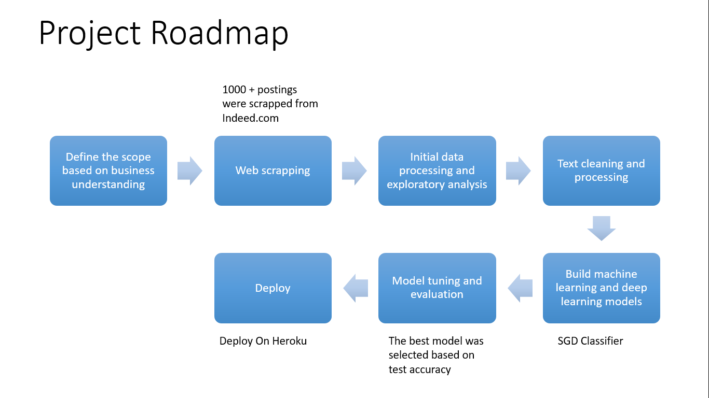
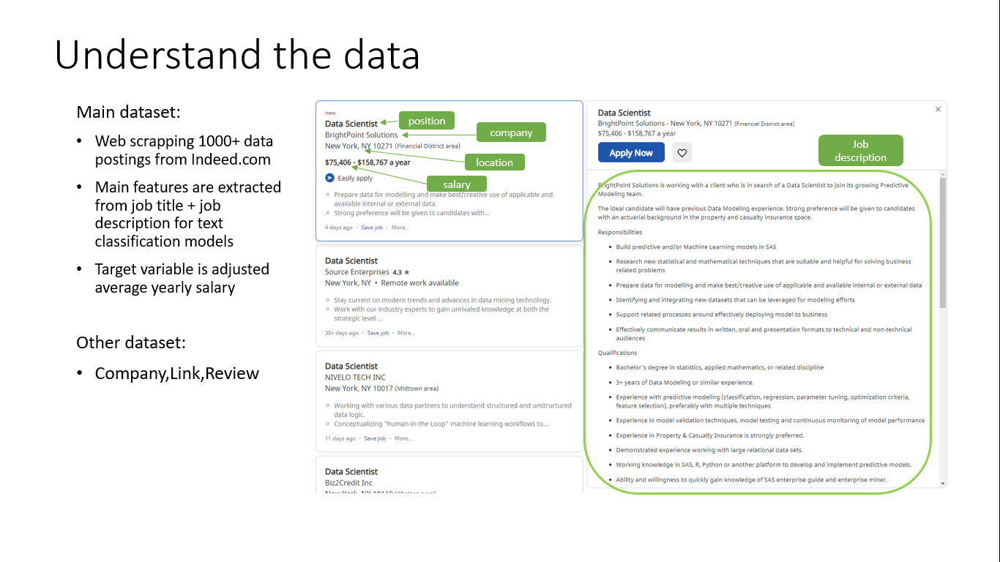

### Tools
1. For Scrapping - Selenium
2. Preprocessing - nltk,stopwords
3. Model Build - tfidfvectorizer, classification(SGD)

## Business Understanding 
This project aims to predict salary for specific fields - data related positions. Therefore, the training and test data is better to be limited within data/analytics related job positions to get more valuable features. When scrapping the data, we make sure one of these keywords exist in the whole job description: 'data analytics','data science','analysis'.

## Data Sources
Indeed.com, 1000+ jobs were scrapped from Indeed.com By using Selenium

### Project Roadmap

### Understand Data

### Output

